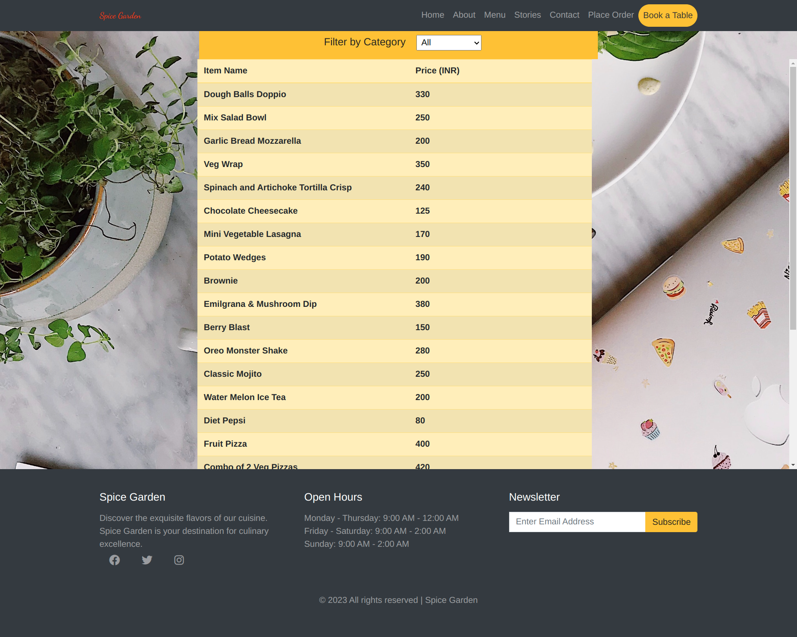
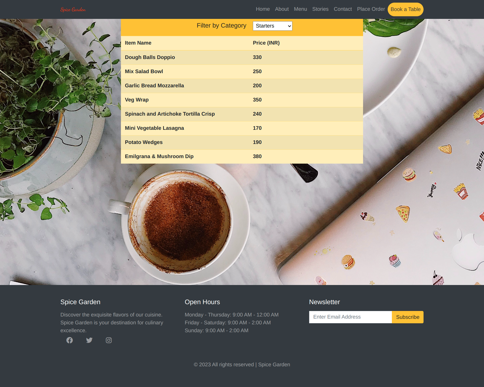
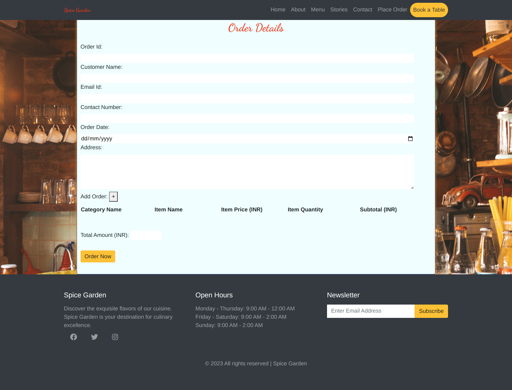
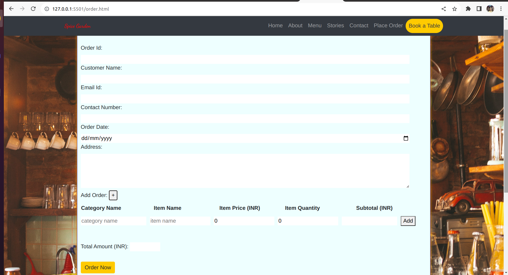
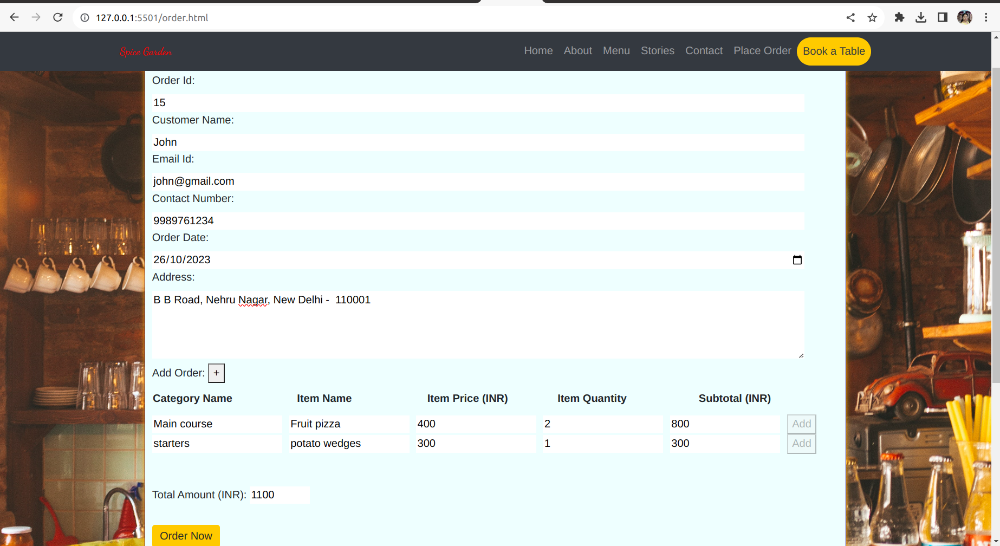
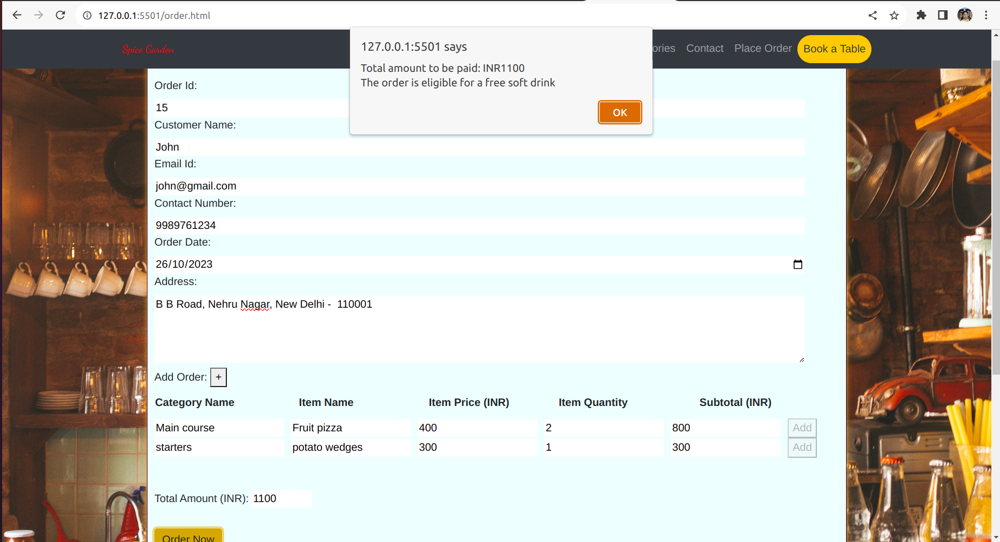
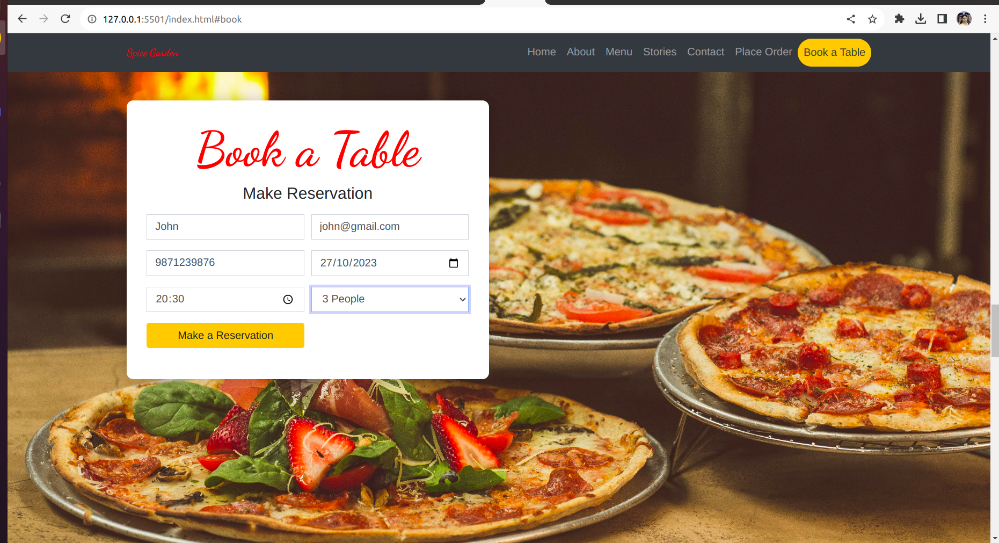
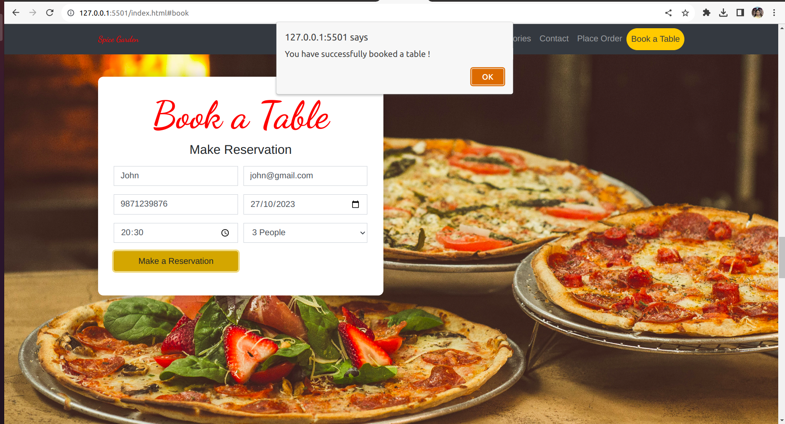

## Project: Spice Garden Restaurant - Develop Interactive Order Processing Pages

### Context

The "Spice Garden" restaurant had garnered quite a reputation for its delectable and custom-made variety of dishes. It wasn't just the flavors that set The Spice Garden apart; it was their unique approach to customer service.

At The Spice Garden, patrons could place an order for any dish of their choice by simply calling the restaurant. Whether it was a mouthwatering cheese burst pizza or a plate of sizzling noodles, the customers had the freedom to customize their orders to their heart's content. This personalized approach had diners raving about the restaurant far and wide.

To make the ordering process even more convenient, the restaurant decided to embrace modern technology. They developed a user-friendly web application that allowed their call operators to streamline the process. With this application, the operators could easily access the restaurant's menu, enter order details on behalf of the customers, and crucially, persist this information for future reference.

In essence, the restaurant aimed to create a digital system that not only enhanced their customer service but also enabled them to better understand their clientele's preferences and history.

The goal was clear: to develop a JavaScript program that would be the backbone of this system, giving The Spice Garden's call operators the tools they needed to continue providing their patrons with the exceptional, personalized dining experience they had come to expect.

### Problem Statement

Create a JavaScript program that would empower the call operators of the Spice Garden restaurant. This program needed to do several things:
- Allow the operator to view the menu items by categories like "starters", "Main course", "Beverages" and "Desserts".
- Provide an interface for the operator to enter customer details such as name, contact information, delivery address, menu items and their quantity and cost, and calculate the total cost of the order.
- Provide an interface for the operator to reserve a table on behalf of customers for a specified date and time.
- Persist this data for future reference, ensuring that the restaurant could maintain accurate records of orders and customer preferences.

Note: Reuse the responsive web page created for "Spice Garden" restaurant in HTML project. Add / modify the required code to achieve the expected outcome.

### Tasks

1. **Allow the restaurant operator to view the menu items**

    - When the "Menu" link is clicked, the operator should be able to view the entire menu details on the app to place an order.​
    - Create `menu.html` file which displays the menu details in tabular format.
    - Selected menu items should be listed when a particular category is selected, e.g. starters.​
    - Open `menu.js` file to​
        - define the function which fetches the menu data from the server using Axios API and display it.​
        - define the function to filter the menu items using Array's `filter()` method based on a particular category and display them.​

#### Expected Output: For Reference

**Spice Garden restaurant full web page**

**Complete Menu List**

**Filtered Menu list**

2. **Provide an interface to persist an order**

- When the "Place Order' link is clicked, the operator should be able to place an order with the required details as mentioned below. Following are the sub-tasks to accomplish it.

    1. **Create Order form with Validations**

        - Create `order.html` file to create an order form with the fields and validations as listed in the table below.​
        - Error messages should be displayed for the field inputs that do not fulfil the validation criteria. 
        - Forms with invalid inputs should not get submitted.​

        | Input Field​          | Validation​                                                      |
        | --------------------- | ---------------------------------------------------------------- |
        | Order Id​             | Should not be left blank​                                        |
        | Order Date​           | Should be in correct date format​      |
        | Customer Name​        | Should not be left blank                       |
        |  Email Id      | Should not be left blank and should allow input of type email​   |
        | Contact Number      | Should not be left blank  and  takes only 10 digitted number​​                                         |
        | Customer Address​ | Should not be left blank and should have minimum 10 characters   |                                   |
        | Order Amount​         | Should be non-editable and get updated as order items are added​ |

        Dynamically Added Form Fields

        | Input Field​          | Validation​                                                      |
        | --------------------- | ---------------------------------------------------------------- |
        | Category​  | Should not be left blank​                                                |
        | Item Name​ | Should not be left blank​                                                |
        | Price​     | Should not be left blank and should allow only numbers. Default value should be 0​  ​     |
        | Quantity​  | Should not be left blank and should allow only numbers. Default value should be 0​                  |
        |Total Amount​    | Should be non-editable and get updated as price or quantity are updated. |

    #### Expected Output: For Reference
    **Initial Place order form**

    

    2.  **Add Order Items Dynamically**

        - Inside `order.html` file, add a button with the “+” icon in th order form.​
        - Open `order.js` file to add JavaScript function such that when the user clicks the "+" button, input fields should get added dynamically, allowing the user to input order item details such as:

            * Category – should be an input field that allows the user to input category.​

            * Item name –  should be an input field that allows the user to input menu item.​

            * Price – should be an input field that allows only numbers to be inputted.

            * Quantity – should be a input field that allows only numbers to be inputted.​

            * Amount – should be a read-only field that displays the total amount whenever the price or quantity is updated.​

            * Add button  – Associate with click event listener programmatically to handle the click event.​

        #### Expected Output: For Reference

        **Dynamically added order items form fields**

        

    3. **Calculate Total Bill Amount​**

        - Edit `order.js` to ensure the following:
            - As the user enters order items and click the "add" button,​
                - The text field for “Total Bill Amount” should get updated with the sum of the amount of all order items.​
                - Make all fields read-only​
                - Disable the active state of the "add" button
            - When the user clicks on “Order Now” button, 
                - Calculate the number of "main course" dishes ordered. The restaurant gives one soft drink free when the customer order contains two or more "main course" dishes. Hence, generate a message `The order is eligible for a free soft drink!` if the number of "main course" ordered is greater than or equal to 2. This message can be displayed along with order details once order details are saved successfully. 
                - Persist the captured order details in the `json-server` using Axios API calls.​
                - Once the order details are saved, the app should display the text `Total amount to be paid: INR <total-amount-value>` along with free soft drink details if applicable on the page.

        #### Expected Output: For Reference

        **Order form with values**

        

        **Order form after successful submission**

         

3. **Provide an interface to reserve/book a table**

- When the "Book a table" button is clicked, the operator should be able to reserve a table as per the details listed in the table.
- Edit the file `index.html` to apply the listed HTML5 validations on the form fields. 
- Open `reserve.js` file to​ save valid reservation details in the `json-server` using Axios API. 
- Once the reservation details are saved, the app should display the text `You have successfully booked a table!` on the page.
  

| Input Field  | Validation Requirement |
| - | - |
| Name​ |Should not be left blank ​|
| Email​ | Should not be left blank and should allow input of type email​ |
| Phone​ | Should not be left blank and should allow valid phone number pattern​ |
| Date​ | Should not be left blank​ and should allow input of type date |
| Time | Should not be left blank​ and should allow input of type time |
| Number of Persons |    |

#### Expected Output: For Reference

**Reserve Table form with values**

**Reserve Table Form after submission** 

#### Instructions for the Project

- Fork the boilerplate into your own workspace.​​​​​​
- Clone the forked boilerplate into your local system.
- Develop interactive web pages for the requirements specified.
- Write CSS code in the files inside `css` folder of the boilerplate to style the web page.
- Write JavaScript code in the files located inside `js` folder of the boilerplate.
- Start json-server for menu, reservation and order to manipulate data from `menu.json`, `reservations.json`, `order.json` respectively located under `json` folder. ​
- Use different port numbers for each json-server. Eg. 3000, 3001 and 3002. ​
- Open the `index.html` file using Live Server and test the output.​
- Test the outcome and ensure it fulfills the stated requirements.​​
- Submit the files for manual evaluation.